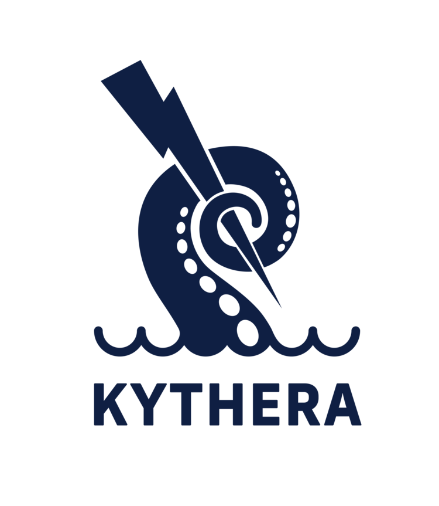

# Kythera Kubernetes Deployment Crawler 

Automatically crawls through resources in a lab Kubernetes cluster and acts according to [certain conditions outlined here](#configuration-defaults). As of now, Kubernetes Deployment Crawler will delete deployments and their associated resources if the waiting reason and/or pod restart counts dictate.

If your lab Kubernetes clusters are filling up with non-Running pods, then the Kubernetes Deployment Crawler's automatic deletion
can assist. Future iterations of this project can involve other actions based on crawling through Kubernetes cluster resources, such as generating reports per namespace without actually deleting. 

<p align="center">
    <a href="https://github.com/att-cloudnative-labs/kythera-k8s-deployment-crawler/graphs/contributors" alt="Contributors">
		
	</a>
	<a href="https://github.com/att-cloudnative-labs/kythera-k8s-deployment-crawler/commits/master" alt="Commits">
		
	</a>
	<a href="https://github.com/att-cloudnative-labs/kythera-k8s-deployment-crawler/pulls" alt="Open pull requests">
		
	</a>
	<a href="https://github.com/att-cloudnative-labs/kythera-k8s-deployment-crawler/pulls" alt="Closed pull requests">
    	
	</a>
	<a href="https://github.com/att-cloudnative-labs/kythera-k8s-deployment-crawler/issues" alt="Issues">
		
	</a>
	</p>
<p align="center">
	<a href="https://github.com/att-cloudnative-labs/kythera-k8s-deployment-crawler/stargazers" alt="Stars">
		
	</a>	
	<a href="https://github.com/att-cloudnative-labs/kythera-k8s-deployment-crawler/watchers" alt="Watchers">
		
	</a>	
	<a href="https://github.com/att-cloudnative-labs/kythera-k8s-deployment-crawler/network/members" alt="Forks">
		
	</a>	
</p>
<p align="center">
  <a href="https://goreportcard.com/badge/github.com/att-cloudnative-labs/kythera-k8s-deployment-crawler" alt="Go Report Card">
    
  </a>	
</p>

## Deployment
Helm is required to install the Kyther Kubernetes Deployment Crawler. For information on installing Helm please refer to the [Helm quickstart guide](https://helm.sh/docs/using_helm/). After installing helm the following steps can be manually run

1. Build docker image
```bash
$ docker build -t kubecrawler .
```
2. Run helm template to install Kubecrawler
```bash
$ helm template kubekleaner --set image=<KUBECRAWLER_IMAGE> | kubectl create -f -
```

Or the makefile can be used pulling values from ./helm/kubecrawler/values.yaml

```bash
$ make
```

## Configuration Defaults

Under the ```configs``` folder, the ```config.yaml``` has the following default configurations:

* Pod waiting reasons
  * CrashLoopBackOff
  * ImagePullBackOff
  * ErrImagePull
  * Completed
  * Failed
* Pod restart threshold
  * 144
    * If the pod restart threshold is at least this number *and* has a pod waiting reason of ```CrashLoopBackOff```, then Kubernetes Deployment Crawler will delete the associated resources

Function configurations can be found in ~/helm/kubecrawler/values.yaml

*name: Name to use for deployment.
*image: Image used in deployment.
*cron: Cron expression used to schedule Crawler. Any valid cron expression can be used.
*namespace: Namespace job will be deployed in.

## Contributing

1. [Fork Kubernetes Deployment Cleaner](https://github.com/att-cloudnative-labs/kythera-k8s-deployment-crawler/fork)
2. Create your feature branch (`git checkout -b feature/fooBar`)
3. Commit your changes (`git commit -am 'Add some fooBar'`)
4. Push to the branch (`git push origin feature/fooBar`)
5. Create a new Pull Request

## Additional info

<p align="center">
  <a href="https://kythera.io" alt="Kythera">
    
  </a>	
</p>

Part of Kythera: Kubernetes Projects for Developers and Operators – [kythera.io](https://kythera.io). 

<p align="center">
  <a href="https://github.com/att-cloudnative-labs" alt="AT&T Cloud Native Labs">
    
  </a>	
</p>

Maintained and in-use by the Platform Team @ AT&T Entertainment Cloud Native Labs.

Distributed under the AT&T MIT license. See ``LICENSE`` for more information.
